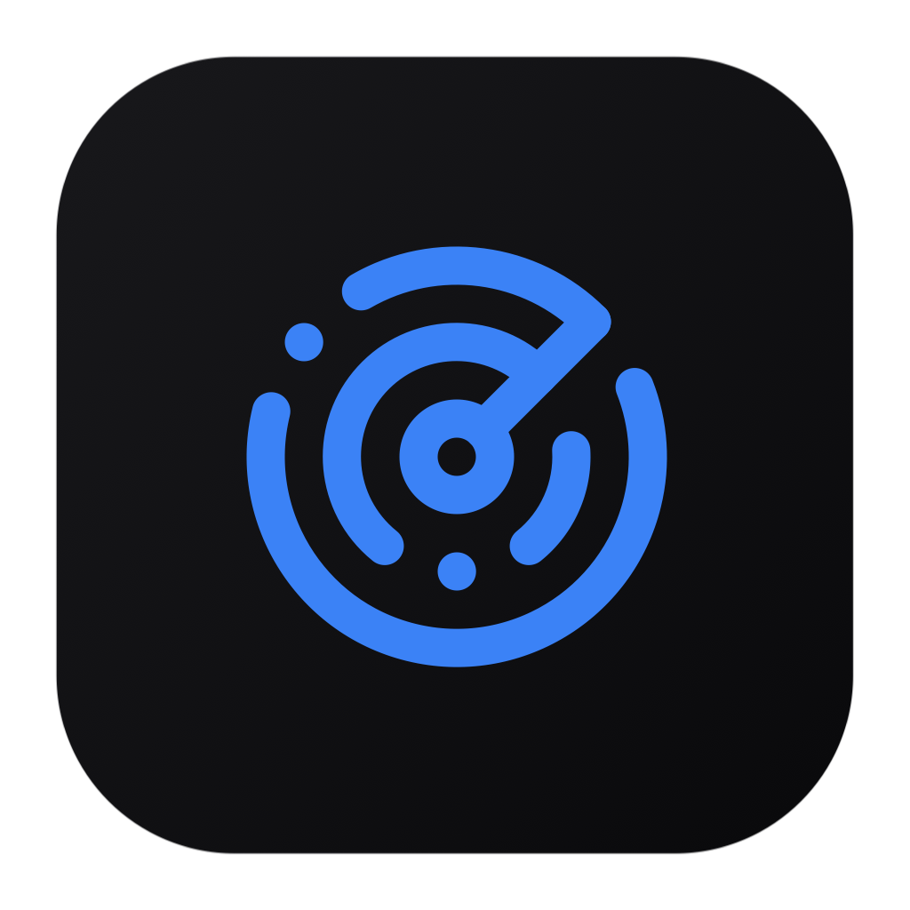

<div align="center">
  
  <h1>🤝 Contributing to Sonar Code Editor</h1>
</div>

First off, thank you for considering contributing to **Sonar Code Editor**! We welcome contributions from everyone. Whether it's a bug fix, new feature, or documentation update, your help is appreciated.

---

## 🛠️ How to Contribute

### 🍴 1.⃣ Fork the Repository
Click the **"Fork"** button at the top right of this repository's page to create a copy of the project in your own GitHub account.

### 💻 2.⃣ Clone Your Fork
Clone the forked repository to your local machine:
```bash
git clone https://github.com/YOUR-USERNAME/Sonar-Code-Editor.git
cd Sonar-Code-Editor
```

### 🌱 3.⃣ Create a Branch
Create a new branch for your feature or bugfix:
```bash
git checkout -b feature/your-feature-name
```
*(Use `bugfix/` or `fix/` prefix for bug fixes)*

### 🛠️ 4.⃣ Make Your Changes
Make the necessary code changes. Ensure your code follows the existing style and conventions of the project.

### 📝 5.⃣ Commit Your Changes
Commit your changes with a clear and descriptive commit message:
```bash
git add .
git commit -m "feat: concise description of your feature"
```

### 🚀 6.⃣ Push to Your Fork
Push the changes up to your repository:
```bash
git push origin feature/your-feature-name
```

### 🔄 7.⃣ Create a Pull Request (PR)
1. Go to the original Sonar Code Editor repository on GitHub.
2. Click on the **Pull Requests** tab, then the **New Pull Request** button.
3. Click the link to **compare across forks**.
4. Select your fork and branch on the right side.
5. Provide a clear title and detailed description for your PR.
6. Click **Create Pull Request**.

We will review your PR as soon as possible. Thank you for your contribution! 🎉 🎉
